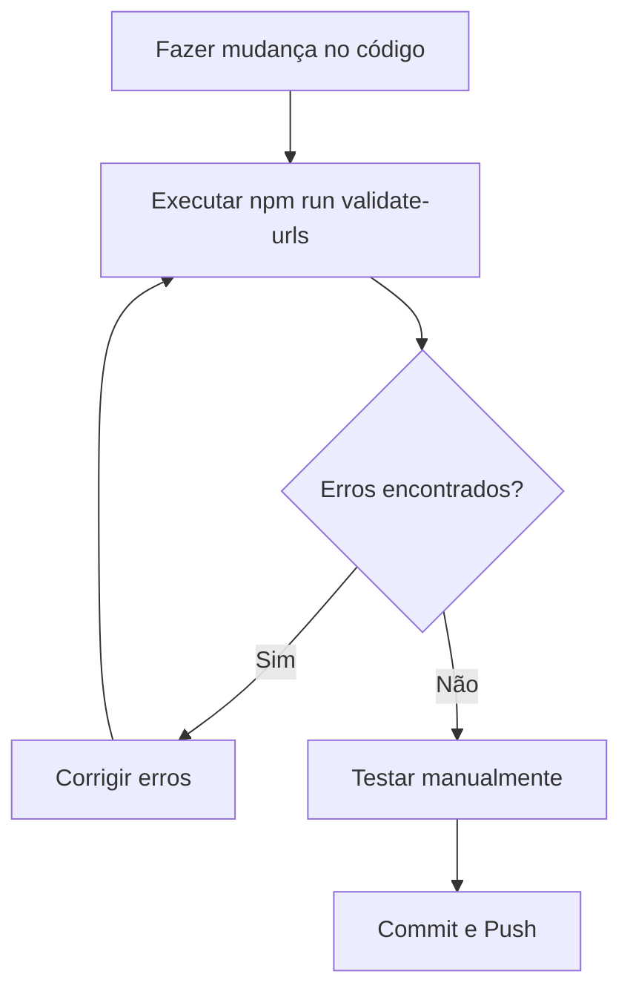

# 🛡️ Lista de Verificação - Prevenção de Problemas de URL

## 📋 Checklist para Desenvolvedores

Antes de fazer commit ou deploy, verifique:

### ✅ URLs e Portas
- [ ] Links de loja apontam para frontend (porta 5173)
- [ ] Links de admin apontam para admin (porta 5174)
- [ ] QR codes de mesa apontam para frontend (porta 5173)
- [ ] Não há URLs hardcoded desnecessárias

### ✅ Configuração Centralizada
- [ ] Usar `admin/src/config/urls.js` para URLs no admin
- [ ] Usar variáveis de ambiente no backend
- [ ] Não hardcodar URLs diretamente no código

### ✅ Testes Automáticos
- [ ] Executar `npm run validate-urls` antes do commit
- [ ] Verificar se todos os testes passam
- [ ] Testar links manualmente após mudanças

## 🚨 Sinais de Alerta

Fique atento a estes problemas comuns:

### ❌ Problemas Críticos
- Link de loja levando para painel admin
- QR code de mesa abrindo página de admin
- Erro 404 em links gerados
- URLs com porta errada

### ⚠️ Problemas Menores
- URLs hardcoded em múltiplos lugares
- Falta de configuração para produção
- Comentários desatualizados sobre URLs

## 🔧 Comandos Úteis

```bash
# Validar todas as URLs
npm run validate-urls

# Iniciar todos os serviços
npm run dev:all

# Testar apenas URLs
npm run test:urls

# Setup completo do projeto
npm run setup
```

## 📝 Processo de Correção

### Quando encontrar problema de URL:

1. **Identificar o problema**
   ```bash
   npm run validate-urls
   ```

2. **Localizar o arquivo problemático**
   - Verificar saída do script de validação
   - Buscar por padrões problemáticos

3. **Aplicar correção**
   - Usar configuração centralizada
   - Corrigir porta/URL incorreta
   - Atualizar comentários

4. **Validar correção**
   ```bash
   npm run validate-urls
   ```

5. **Testar manualmente**
   - Acessar admin em http://localhost:5174
   - Gerar link da loja
   - Verificar se abre página do cliente

## 🎯 Melhores Práticas

### ✅ Faça
- Use configuração centralizada
- Documente mudanças de URL
- Execute validação antes do commit
- Teste links após mudanças
- Use variáveis de ambiente em produção

### ❌ Não Faça
- Hardcode URLs diretamente
- Misture portas de cliente e admin
- Ignore avisos do script de validação
- Faça deploy sem testar links
- Esqueça de atualizar documentação

## 🔄 Fluxo de Desenvolvimento



## 📞 Suporte

Se encontrar problemas:
1. Consulte este checklist
2. Execute o script de validação
3. Verifique o URLS_GUIDE.md
4. Teste manualmente os links

---

**Lembre-se**: A prevenção é sempre melhor que a correção! 🛡️